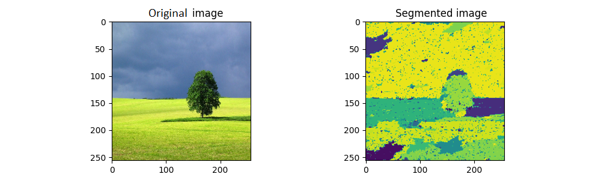

# Graph-based Image Segmentation

This repository contains the implementation of a graph-based image segmentation algorithm. It was developed as an assignment for a computer vision post-graduate course.

## Overview

Image segmentation is a fundamental task in computer vision, aiming to partition an image into meaningful regions. The graph-based image segmentation algorithm used in this project utilizes the concepts of graph theory to identify homogeneous regions within an image.

## Example

Below is an example that demonstrates the original image and its corresponding segmented output:



In the example above, the algorithm successfully separates the objects in the image into distinct regions, enabling further analysis and processing.

## Usage

To use this implementation, follow these steps:

1. Clone the repository:

```bash
git clone https://github.com/igeor/Graph-based-Image-Segmentation.git

2. Navigate to the repository:

```bash 
cd Graph-based-Image-Segmentation


3. Run the segmentation algorithm on your desired image:

```bash
python run.py --image_path images/your_image.jpg --image_size 128 --sigma 4. --neigh 3 --K 120
